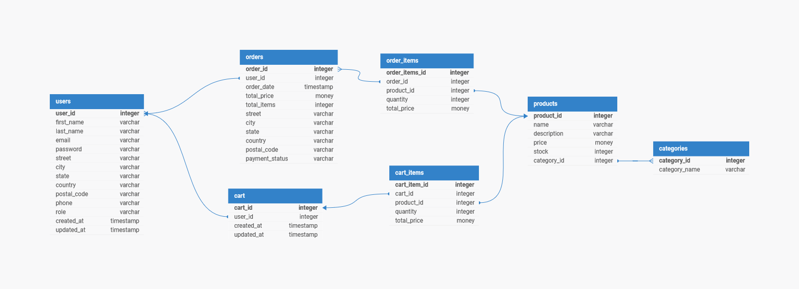

# My e-commerce REST API portfolio project

## Overview
This project is an e-commerce application REST API built using Express, Node.js, and PostgreSQL. E-commerce applications are crucial in the world of online business, providing the backbone for countless transactions across the internet. This API allows users to perform various CRUD operations such as registering an account, browsing products for sale, managing their carts, and placing orders.

## Project Objectives
- **Build a functioning e-commerce REST API** using Express, Node.js, and PostgreSQL.
- **User Authentication**: Allow users to register and log in via the API.
- **Product Management**: Allow CRUD operations on products.
- **User Account Management**: Allow CRUD operations on user accounts.
- **Cart Management**: Allow CRUD operations on user carts.
- **Order Management**: Allow users to place orders and perform CRUD operations on orders.
- **Version Control**: Use Git for version control.
- **Command Line**: Develop and manage the application via the command line.
- **Local Development**: Develop and test the application locally on your computer.
- **API Documentation**: Document the API using Swagger.

## Getting Started

### Installation
To get started with the project locally, follow these steps:

1. **Clone the repository**:
    ```bash
    git clone https://github.com/your-username/e-commerce-api.git
    cd e-commerce-api
    ```

2. **Install dependencies**:
    ```bash
    npm install
    ```

3. **Set up the PostgreSQL database**:
   - Create a new PostgreSQL database.
   - Configure your database connection in a `.env` file (based on the `.env.example`).

4. **Run database migrations**:
    ```bash
    npx sequelize-cli db:migrate
    ```

5. **Start the server**:
    ```bash
    npm start
    ```
    The API should now be running on `http://localhost:3000`.

### API Documentation
API documentation is provided using Swagger. To view the documentation:

1. Ensure the server is running.
2. Open your web browser and navigate to `http://localhost:3000/api-docs`.

This will provide you with an interactive interface to explore and test the API endpoints.

## Features
- **User Registration and Authentication**: Users can create accounts and log in securely.
- **Product Browsing and Management**: CRUD operations for managing product listings.
- **Shopping Cart**: Users can add items to their cart, update quantities, and remove items.
- **Order Placement and Management**: Users can place orders and manage them.
- **User Profile Management**: CRUD operations for managing user information.

## Entity-Relationship Diagram (ERD)
Below is the ERD that represents the structure of the database for the e-commerce application:



## Technologies Used
- **Node.js**: JavaScript runtime environment for server-side development.
- **Express.js**: Web framework for building the REST API.
- **PostgreSQL**: Relational database management system.
- **Sequelize**: ORM for database management and migrations.
- **Swagger**: API documentation tool.
- **Git**: Version control system.

## Development Process
This project was developed using a local development environment. Key development practices include:

- **Version Control**: Git was used for version control with a focus on feature branches and regular commits.
- **Testing**: The API was tested locally using tools like Postman and automated tests.
- **Documentation**: Swagger was used to document the API for ease of use and reference.

## Contact
If you have any questions or feedback, feel free to reach out:

- **Email**: joshua.mclelland2@yahoo.com
- **GitHub**: [joshua-mcfield99](https://github.com/joshua-mcfield99)
